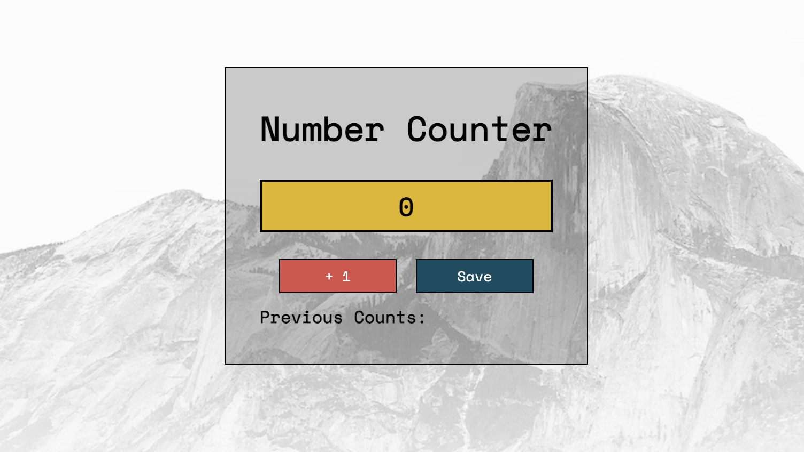

# Number Counter

## Description

This is a mini project that counts up in increments of 1 by clicking a button. In addition to this, you are given the ability to save the count and add it to the 'Previous Entries' section that is displayed underneath the buttons. I used HTML, CSS and vanilla Javascript to make the page which can be found here: https://cedekpoole.github.io/number-counter/. This project might come in handy for anyone wanting to keep tally of a score, counting the number of cars in a parking lot, or anything that involves keeping track of a number to keep count. 

## Installation 

N/A

## Usage 

To add to the count, press the button on the left (the button labelled '+1'). Keep pressing said button until you have reached the desired number. Once you want to save the entry and add it to your previous counts, press the button on the left labelled 'save'. You will see that the number will appear underneath the buttons. In addition to this, you can save multiple entries by repeating the process. 

## Credit 

This mini project was a challenge from Scrimba's JavaScript course (https://scrimba.com/). 

## License 

N/A